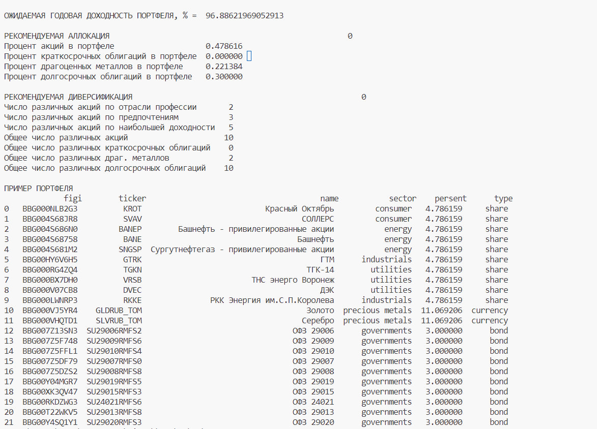

# Readme (Инструкция)

Работу модели можно посмотреть в файле “recommendation_model.py”.

Что бы установить необходимые библиотеки, выполните команду:
```python
python -m pip install -r requirements.txt
```

* В начале файла прописываются входные данные инвестора, тестовый промежуток и текущий экономический цикл.

* Файл выполняется ~10 мин. В результате, в консоль выводятся доступная информация по портфелю, как на скрине ниже:



Для загрузки котировок и бумаг используется TincoffAPI. Чтобы подключиться к нему, вам нужно создать личный файл .env и прописать в нем соответствующий токен в формате:

```python
TINKOFF_API_KEY=''
```

Создать личный токен можно на странице: [https://www.tinkoff.ru/invest/settings/](https://www.tinkoff.ru/invest/settings/)

Удачной работы!
